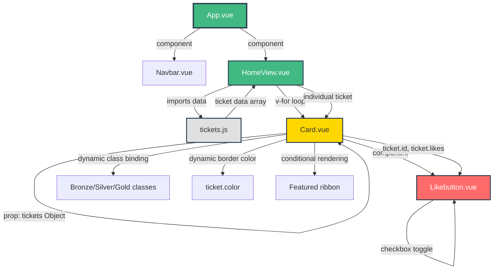

# cooking-masterclass-catalogue

This template should help get you started developing with Vue 3 in Vite.

## Recommended IDE Setup

[VS Code](https://code.visualstudio.com/) + [Vue (Official)](https://marketplace.visualstudio.com/items?itemName=Vue.volar) (and disable Vetur).

## Recommended Browser Setup

- Chromium-based browsers (Chrome, Edge, Brave, etc.):
  - [Vue.js devtools](https://chromewebstore.google.com/detail/vuejs-devtools/nhdogjmejiglipccpnnnanhbledajbpd) 
  - [Turn on Custom Object Formatter in Chrome DevTools](http://bit.ly/object-formatters)
- Firefox:
  - [Vue.js devtools](https://addons.mozilla.org/en-US/firefox/addon/vue-js-devtools/)
  - [Turn on Custom Object Formatter in Firefox DevTools](https://fxdx.dev/firefox-devtools-custom-object-formatters/)

## Customize configuration

See [Vite Configuration Reference](https://vite.dev/config/).


## Project Setup
```sh
git clone <repo-url>
cd <repo>
```

```sh
npm install
```

### Compile and Hot-Reload for Development

```sh
npm run dev
```
 ## 📌 Project Overview

This project showcases:

- A responsive ticket showcase layout 

- A reusable Ticket Card component displaying tier data dynamically

- A locally stored tickets.js data file for tier listings

- Featured tier highlighting to draw attention to premium options

- An interactive favourite (like) button with live count updates

- Hover animations and subtle UI effects for a modern experience

- Responsive design suitable for both desktop and mobile screens

- Clean component separation using props 

The app loads ticket data from a standalone tickets.js file and renders cards inside HomeView.vue using a v-for loop.
When a user favourites a ticket, the interaction updates the local state within the card component and visually reflects the change instantly on the page.

---

## Diagram

---

## Image


